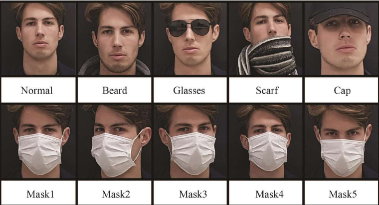

# Face Recognition for Masked Individual face

---
---
 

# Feature

1. Face Authentication with Mask Support:     

Developed a face recognition system that enables identity verification even while wearing a mask, addressing the issue where iPhone Face ID fails with masked faces at 2021.

 
 

2. Image Preprocessing & Normalization:    

Applied pixel normalization and preprocessing techniques to enhance recognition accuracy.

 
 

3. One-Shot Learning Implementation:    

Used one-shot learning to improve model efficiency and performance with limited training data.

 
 

4. Positive & Negative Pair Formation:     

Created positive and negative face pairs to optimize the training process for better identity verification.

 
 

5. Recognition with Disguises:    

Enabled face authentication even when wearing hats, glasses, wigs, or other disguises.

 
 

---
---
 

# Core technologies

- **PyTorch & Keras** - Deep learning frameworks used for building and training the face authentication model. PyTorch provides flexibility in model development, while Keras simplifies experimentation. 

- **MobileNet** - A lightweight and efficient convolutional neural network (CNN) optimized for mobile and embedded vision applications, ensuring fast face recognition with minimal computational cost. 

- **Siamese Network** - A neural network architecture that learns to distinguish between pairs of images by computing similarity scores, making it ideal for one-shot learning in face authentication. 

- **Metric Learning** - A technique that focuses on learning an embedding space where similar images (faces) are placed closer together while different images are pushed apart, improving recognition accuracy. 

---
---
 

## 1. Dataset

<table>
  <tr>
    <td></td>
    <td>
      •63 faces were extracted. 
      •The gender consisted of 21 females and 42males. 
      •The training dataset used image with faces covered by various disguise. 
      •It consisted of a total of 7,560 images, with approximately 15 images per one person. 
      •The test dataset used images with faces covered by masks. 
      •It consisted of a total of 315 images, with approximately 5 images per person. 
    </td>
  </tr>
</table>

 

---
---
 

## 2. Development purpose

- **Face recognition of users wearing masks in limited dataset**  
=> Few shot learnig, Metric learning 
 

- **Lightweight network applicable to embedded devices**  
=> Modified MobileNet V3 
 

- **Verification of network accuracy and stability according to changes in optimization function** 
=> Best choice in first-order function optimizer 
 

---
---
 

## 3. Works

#### **Simames Network Network + MobileNet V3 + Contrastive Loss** 

 

---
---
 

## 4. Results

<table>
  <tr>
    <td></td>
    <td>
      •Accuracy is 96.56% 
      •A dissimilarity of 0.5 or less indicates that the faces are the same. 
      •A dissimilarity of more than 0.5 indicates that the faces are different. 
    </td>
  </tr>
</table>

 

---
---
 

# Paper download

[📄 Download Paper](https://github.com/yh/MasterThesis/yhimages/sample.pdf)

---
---
 
